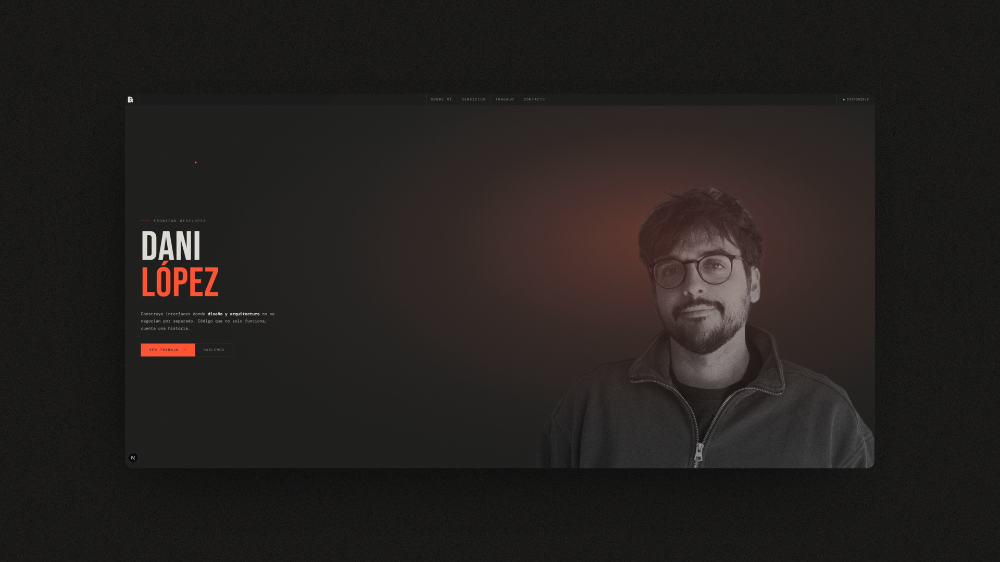

# Portfolio — Dani López González

> Interfaces donde diseño y arquitectura no se negocian por separado.  
> Código que no solo funciona, cuenta una historia.



Stack: Next.js 16 · TypeScript · Tailwind CSS · GSAP

## Arrancar

```bash
npm install
cp .env.local.example .env.local
# rellenar RESEND_API_KEY, FROM_EMAIL y CONTACT_EMAIL
npm run dev
```

## Dependencias externas (mínimas y justificadas)

| Paquete                   | Por qué                                            |
| ------------------------- | -------------------------------------------------- |
| `@radix-ui/react-label`   | `<Label>` accesible con `htmlFor` y ARIA correctos |
| `sonner`                  | Toast de feedback del formulario                   |
| `clsx` + `tailwind-merge` | `cn()` helper para clases condicionales            |
| `zod`                     | Validación del formulario de contacto              |
| `react-hook-form`         | Gestión de estado y errores del formulario         |
| `resend`                  | Envío de emails desde el API route                 |
| `@react-email/*`          | Template HTML del email de contacto                |

Todo lo demás es vanilla — sin shadcn, sin component libraries.

## Estructura

```
src/
├── app/
│   ├── layout.tsx              # fuentes, Toaster global
│   ├── page.tsx
│   ├── globals.css
│   ├── opengraph-image.tsx
│   ├── sitemap.ts
│   ├── robots.ts
│   ├── enlaces/page.tsx        # página de links (bio link)
│   └── api/contact/route.ts    # Resend
├── components/
│   ├── layout/
│   │   ├── Navbar.tsx
│   │   └── Footer.tsx
│   ├── sections/
│   │   ├── Hero.tsx
│   │   ├── About.tsx
│   │   ├── Skills.tsx
│   │   ├── Projects.tsx        # datos desde lib/projects.ts
│   │   └── Contact.tsx         # react-hook-form + zod + Sonner
│   └── ui/
│       ├── Ticker.tsx
│       ├── CursorDot.tsx
│       ├── RevealOnScroll.tsx
│       ├── Label.tsx           # Radix Label
│       └── Toaster.tsx         # Sonner con tokens del diseño
├── emails/
│   └── ContactEmail.tsx        # template React Email
└── lib/
    ├── utils.ts                # cn()
    ├── projects.ts
    ├── skills.ts
    ├── rate-limit.ts
    └── schemas/contact.ts      # schema Zod compartido
```
